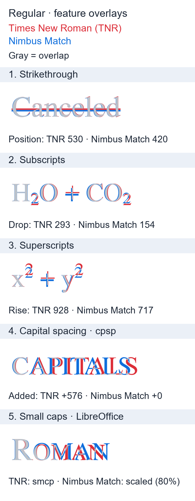

# Nimbus Match

[](https://github.com/IvanaGyro/nimbus-match/actions/workflows/weekly_font_release.yml)
[](https://www.gnu.org/licenses/agpl-3.0)

**Nimbus Match** is a **Times New Roman metric-compatible font**, designed to look closer to TNR than Tinos and other metric-compatible alternatives. It combines Nimbus Roman letterforms with Tinos metrics in four styles: **Regular**, **Bold**, **Italic**, and **Bold Italic**.

It uses [Tinos](https://github.com/googlefonts/tinos) metrics at 2048 units per em, with explicit TNR corrections. The comparisons below show remaining metric and feature differences; application rendering can also vary.

> [!TIP]
> Download **`NimbusMatch.otc`** (OpenType Collection) from the latest [Release](https://github.com/IvanaGyro/nimbus-match/releases) to install all 4 font variants in 1 click!

---

## 🎨 Visual Comparison

Regular style: **red = Times New Roman**, **blue = Nimbus Match**. Shared areas are light gray so differing outlines stand out.


---

## 🔍 Nimbus Match vs. Times New Roman

Measured from the built **Nimbus Match Regular** and local **Times New Roman Regular** fonts. Values are font units (2048 per em); results may vary with font versions.



### Key Differences

- **Strikethrough:** Nimbus Match places the line lower (420 vs. 530).
- **Sub / superscripts:** Nimbus Match drops subscripts less (154 vs. 293) and raises superscripts less (717 vs. 928). The image illustrates `OS/2` offsets; application rendering can differ.
- **Capital spacing (`cpsp`):** The feature is enabled for both fonts. TNR adds spacing; Nimbus Match has no `cpsp` adjustment.
- **Small caps (`smcp`):** The feature is enabled for both fonts. TNR substitutes small capitals; Nimbus Match keeps lowercase letters. The preview does not synthesize small caps.

Only supported characters are compared. The `cpsp` and `smcp` examples use HarfBuzz shaping and FreeType rendering.

### Extra Characters

Of Nimbus Roman's 122 entries absent from Tinos, only `ff` (U+FB00) is encoded in the tested TNR 7.12 fonts. Nimbus Match uses fixed TNR advance widths for it: **1237 / 1200 / 1137 / 1225** (Regular / Bold / Italic / Bold Italic). The build uses these constants without reading TNR.

The other 121 entries retain Nimbus Roman's scaled metrics as extra coverage. TNR compatibility applies to shared characters; font fallback can differ for the extras.

<details>
<summary>Regenerate the comparisons</summary>

Build the fonts first, then run these commands with Times New Roman installed. The preview generators read TNR to render its actual outlines and features; the font build does not require TNR.

```bash
pixi run python generate_comparison.py --fonts-dir dist --style Regular --require-times-new-roman --out nimbus_match_regular_preview.png
pixi run python generate_font_details.py
```

</details>

---

## ✨ Features

- **4 Core Font Styles**: Regular, Bold, Italic, Bold Italic.
- **Advance Widths**: Copies Tinos widths, with fixed TNR corrections for `ff` across all 4 styles.
- **UPEM Rescaling**: Rescales 1000 UPEM PostScript fonts to standard 2048 UPEM TrueType grids for high-precision metric alignment.
- **Kerning & GPOS Support**: Preserves and scales 800+ kerning pairs per font style.
- **OpenType Collection (`.otc`)**: Bundles all 4 styles into `NimbusMatch.otc` for 1-click installation across Windows, macOS, and Linux.
- **Automated Upstream Monitoring**: Weekly GitHub Actions workflow monitors URW Base35 & Tinos releases and automatically builds and publishes updated font release binaries.
- **Visual Verification**: Reproducible glyph overlays and metric comparisons against local reference fonts.

---

## 🚀 Quick Start

### Building Fonts Locally

Ensure you have [`pixi`](https://pixi.sh) installed.

```bash
# Clone the repository
git clone https://github.com/IvanaGyro/nimbus-match.git
cd nimbus-match

# Run the build orchestrator (fetches upstream dependencies & generates dist/*)
pixi run python check_and_build.py --force
```

Generated font binaries and comparison PNG will be placed in `dist/`:
- `dist/NimbusMatch.otc` (1-click OpenType Collection containing all 4 styles)
- `dist/NimbusMatch.zip` (Zip bundle containing all 4 font OTF files)
- `dist/NimbusMatch-Regular.otf`
- `dist/NimbusMatch-Bold.otf`
- `dist/NimbusMatch-Italic.otf`
- `dist/NimbusMatch-BoldItalic.otf`
- `dist/nimbus_match_comparison.png`

---

## 🧪 Testing & Code Quality

Run tests and pre-commit checks using `pixi`:

```bash
# Run pytest metric-compatibility test suite
pixi run pytest

# Run code formatters and linters (ruff, pyproject-fmt)
pixi run pre-commit run --all-files
```

---

## 📜 License & Credits

- **Nimbus Roman**: Developed by URW / Artifex Software ([urw-base35-fonts](https://github.com/ArtifexSoftware/urw-base35-fonts)), licensed under the **GNU Affero General Public License v3 (AGPL-3.0)**.
- **Tinos**: Developed by Steve Matteson / Google Fonts ([Tinos](https://github.com/googlefonts/tinos)), licensed under the **Apache License 2.0**.
- **Nimbus Match**: Released under the **GNU Affero General Public License v3 (AGPL-3.0)** to strictly comply with upstream URW Nimbus Roman copyleft requirements. See the [LICENSE](LICENSE) file for complete terms.
