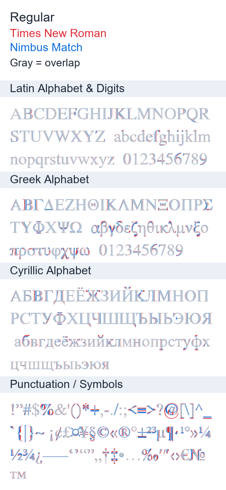
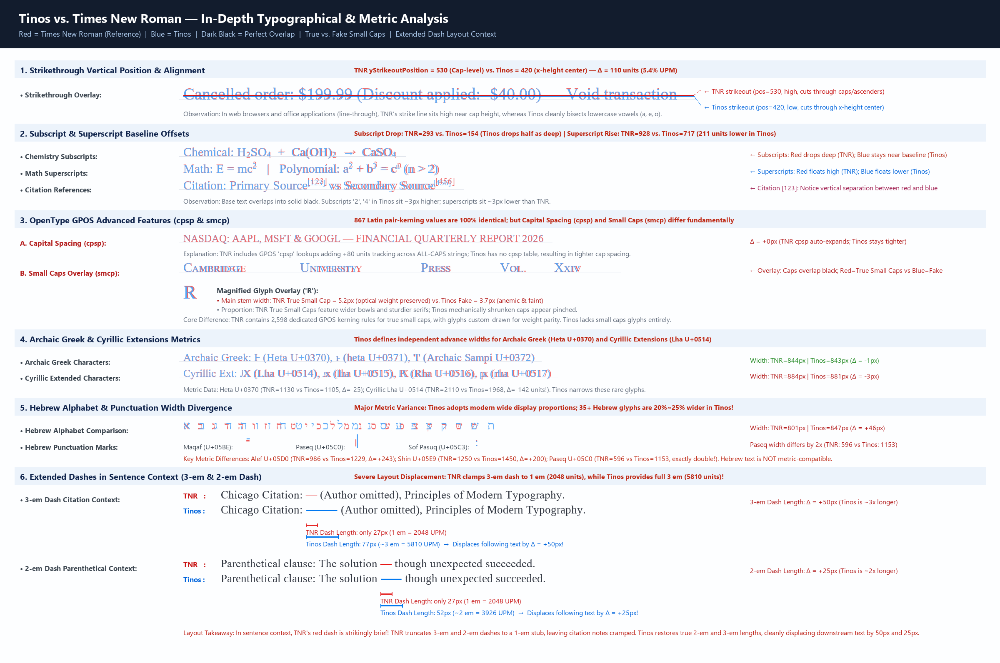

# Nimbus Match

[](https://github.com/IvanaGyro/nimbus-match/actions/workflows/weekly_font_release.yml)
[](https://www.gnu.org/licenses/agpl-3.0)

**Nimbus Match** is a metric-compatible metric generator for **Times New Roman** and **Tinos** across 4 primary styles (**Regular**, **Bold**, **Italic**, **Bold Italic**).

By recalibrating glyph advance widths, font metrics (`usWinAscent`, `usWinDescent`, `hhea.ascent`, `hhea.descent`), units per em (UPEM 2048), and GPOS kerning tables from upstream [URW Nimbus Roman](https://github.com/ArtifexSoftware/urw-base35-fonts) and [Tinos](https://github.com/googlefonts/tinos), **Nimbus Match** ensures exact document layout parity without reflowing text.

> [!TIP]
> Download **`NimbusMatch.otc`** (OpenType Collection) from the latest [Release](https://github.com/IvanaGyro/nimbus-match/releases) to install all 4 font variants in 1 click!

---

## 🎨 Visual Comparison (Regular Style)

Direct inspection of **Times New Roman [RED]** vs. **Nimbus Match [BLUE]** for the **Regular** font style across Latin, Greek, Cyrillic, and punctuation/symbols:



---

## 🔍 Tinos vs. Times New Roman: In-Depth Typographical & Metric Analysis

While **Tinos** (designed by Steve Matteson for Google) serves as a primary open-source metric-compatible alternative to **Times New Roman**, our deep OpenType analysis reveals fundamental vertical, layout, and OpenType feature divergences between them:



### Key Typographical & Metric Findings

1. **Strikethrough Vertical Position (`OS/2.yStrikeoutPosition`)**:
   - **Times New Roman** sets `yStrikeoutPosition = 530` (102 units thickness), cutting high near capital letterheads and ascenders.
   - **Tinos** sets `yStrikeoutPosition = 420` (100 units thickness), cutting lower through the center belly of lowercase x-height glyphs (`a`, `e`, `o`).
2. **Subscripts & Superscripts (`OS/2` Offsets)**:
   - **Subscript Drop**: TNR drops `ySubscriptYOffset = 293` below the baseline, whereas Tinos drops only `154` units (roughly half the depth).
   - **Superscript Rise**: TNR floats `ySuperscriptYOffset = 928`, whereas Tinos rises to `717` (211 units lower than TNR).
3. **OpenType GPOS Advanced Features (`cpsp` & `smcp`)**:
   - **Capital Spacing (`cpsp`)**: TNR incorporates GPOS lookups automatically expanding ALL-CAPS text with `+80` units tracking per capital letter. Tinos lacks the `cpsp` table, leaving capitalized strings tightly spaced.
   - **Small Caps (`smcp`)**: TNR provides authentic, optically compensated Small Caps glyphs (`glyph03450`–`glyph03475`) with 2,598 dedicated kerning pairs, maintaining a full stem thickness (~5.2px at sample size). Tinos lacks small caps glyphs entirely; rendering engines mechanically scale capital letters down by 70%, yielding anemic, thin stems (~3.7px) and unbalanced color.
4. **Archaic Greek & Cyrillic Extensions**:
   - Tinos establishes independent metric advances for rare characters such as Archaic Greek Heta `Ͱ` (`U+0370`: 1105 vs. TNR 1130) and Cyrillic Lha `Ԕ` (`U+0514`: 1968 vs. TNR 2110, narrowing by 142 units).
5. **Hebrew Alphabet & Punctuation**:
   - Tinos features modern wide proportions across 35+ Hebrew glyphs (e.g., Alef `א` is 1229 vs. TNR 986, +25% wider; Paseq `׀` `U+05C0` is 1153 vs. TNR 596, nearly double).
6. **Extended Dashes in Sentence Context (`U+2E3A`, `U+2E3B`)**:
   - In publishing contexts (such as Chicago citation author-omission lines), TNR truncates both the 2-em (`U+2E3A`) and 3-em (`U+2E3B`) dashes to a 1-em stub (2048 units).
   - Tinos delivers full lengths (3926 and 5810 units), cleanly displacing trailing punctuation and text by 25px and 50px respectively.

---

## ✨ Features

- **4 Core Font Styles**: Regular, Bold, Italic, Bold Italic.
- **Strict Metric Compatibility**: Matches horizontal advance widths for over 800 glyphs across all 4 styles to preserve document line breaks and page layout.
- **UPEM Rescaling**: Rescales 1000 UPEM PostScript fonts to standard 2048 UPEM TrueType grids for high-precision metric alignment.
- **Kerning & GPOS Support**: Preserves and scales 800+ kerning pairs per font style.
- **OpenType Collection (`.otc`)**: Bundles all 4 styles into `NimbusMatch.otc` for 1-click installation across Windows, macOS, and Linux.
- **Automated Upstream Monitoring**: Weekly GitHub Actions workflow monitors URW Base35 & Tinos releases and automatically builds and publishes updated font release binaries.
- **Visual Verification Tooling**: Includes `generate_comparison.py` to create direct side-by-side and overlapped rendering inspections against system reference fonts.

---

## 🚀 Quick Start

### Building Fonts Locally

Ensure you have [`pixi`](https://pixi.sh) installed.

```bash
# Clone the repository
git clone https://github.com/IvanaGyro/nimbus-match.git
cd nimbus-match

# Run the build orchestrator (fetches upstream dependencies & generates dist/*)
pixi run python check_and_build.py --force
```

Generated font binaries and comparison PNG will be placed in `dist/`:
- `dist/NimbusMatch.otc` (1-click OpenType Collection containing all 4 styles)
- `dist/NimbusMatch.zip` (Zip bundle containing all 4 font OTF files)
- `dist/NimbusMatch-Regular.otf`
- `dist/NimbusMatch-Bold.otf`
- `dist/NimbusMatch-Italic.otf`
- `dist/NimbusMatch-BoldItalic.otf`
- `dist/nimbus_match_comparison.png`

---

## 🧪 Testing & Code Quality

Run tests and pre-commit checks using `pixi`:

```bash
# Run pytest metric-compatibility test suite
pixi run pytest

# Run code formatters and linters (ruff, pyproject-fmt)
pixi run pre-commit run --all-files
```

---

## 📜 License & Credits

- **Nimbus Roman**: Developed by URW / Artifex Software ([urw-base35-fonts](https://github.com/ArtifexSoftware/urw-base35-fonts)), licensed under the **GNU Affero General Public License v3 (AGPL-3.0)**.
- **Tinos**: Developed by Steve Matteson / Google Fonts ([Tinos](https://github.com/googlefonts/tinos)), licensed under the **Apache License 2.0**.
- **Nimbus Match**: Released under the **GNU Affero General Public License v3 (AGPL-3.0)** to strictly comply with upstream URW Nimbus Roman copyleft requirements. See the [LICENSE](LICENSE) file for complete terms.
