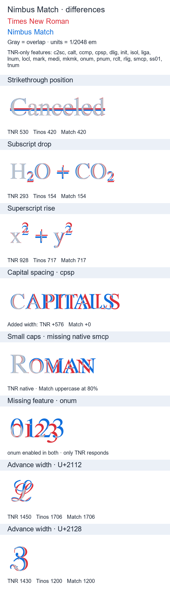

# Nimbus Match

Nimbus Roman outlines with Tinos advances and kerning, built at 2048 units per em. The four styles retain the existing Nimbus Match installation identity and ordinary-text behavior.

## Coverage and features

The audited source has 854 encoded characters per style: 732 shared with Tinos and 122 additional characters. The build preserves every source glyph, including unencoded alternates. Shared advances use Unicode identity. Additional glyphs retain scaled source widths except for explicit Unicode metric policy. Future input coverage is discovered on every build.

Automatic `liga` substitutions are disabled to preserve reference text layout. Nimbus Match has no native `smcp` or `cpsp`. In LibreOffice, use **Font Effects → Case → Small capitals** for the 80% uppercase fallback, with the initial capital at full size. For TNR's native small caps, use `Times New Roman:smcp=1`. These are different application/font controls.

## Differences from Times New Roman

Red is Times New Roman 7.12; blue is Nimbus Match Regular; gray is overlap. Captions compare TNR, Tinos and Match metrics in 2048-unit ems. Only shared supported characters are rendered. The feature list describes the whole fonts; some gaps concern scripts outside the shared coverage. The images illustrate font metrics with HarfBuzz and FreeType, not a guarantee of identical application effects.



[Full measured differences](previews/differences.json) include all shared-character advance differences, not only the largest examples shown above. Strikethrough position is 530 in TNR versus 420 in Tinos/Match; subscript drop is 293 versus 154; superscript rise is 928 versus 717.

## Build and install

```sh
pixi run font-match build --family nimbus-match
```

Resolve inputs first as described in the [project README](../../README.md). Install the four OTFs from `dist/nimbus-match/NimbusMatch.zip` or the separate `NimbusMatch.otc`.

Regenerate differences with explicit local font paths:

```sh
pixi run font-match preview --family nimbus-match --reference C:/Windows/Fonts/times.ttf --tinos path/to/Tinos-Regular.ttf --out families/nimbus-match/previews/differences.png
```

The reference must actually be Times New Roman. This optional command is separate from builds. To run the optional local TNR test suite, set `FONT_MATCH_TNR_TESTS=1` before `pixi run pytest`.

## Credits and notices

Nimbus Roman is from URW/Artifex's [URW Base35 repository](https://github.com/ArtifexSoftware/urw-base35-fonts). Nimbus Match is a modified derivative under AGPL-3.0 with applicable upstream notices. The pinned Tinos reference is from [Google Fonts](https://github.com/googlefonts/tinos), under OFL-1.1. Tinos font files are not packaged.

See [complete redistribution notices](licenses/NOTICES.txt) and each release's BUILD-INFO for exact source revisions, hashes and policies. Ivana maintains this derivative; upstream maintainers are not responsible for the modifications.

The earlier [regular outline specimen](previews/regular.png) is retained for reference.
