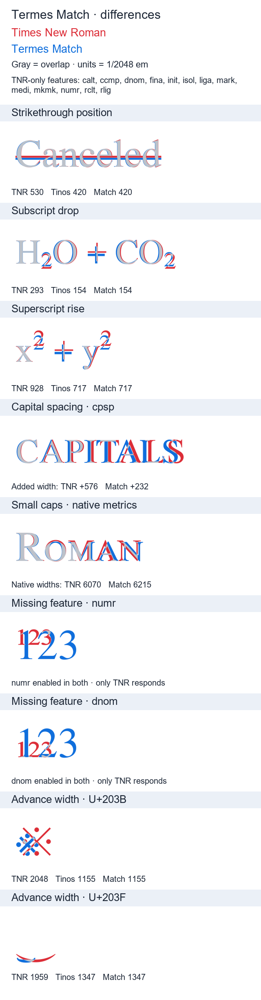

# Termes Match

A Times New Roman metric-compatible font family built from TeX Gyre Termes outlines and Tinos text metrics. It includes Regular, Bold, Italic and Bold Italic and can coexist with the other Match family.

## Build policy

Builds use only the selected outline source and Tinos. All source glyphs are preserved, including future additions and unencoded alternates. Shared-character advances are matched by Unicode identity. Release tags and embedded font versions identify the upstream version pair. Coverage and feature reports can be generated locally, rather than committed as snapshots.

For source-only canonically decomposable accented characters, widths are predicted from a Tinos base character. Explicit Unicode policy takes precedence; otherwise scaled source advances remain. Native source substitutions and non-kerning positioning are preserved, while kerning is replaced and automatic ligatures are disabled to preserve ordinary text layout. TeX Gyre Termes Math is not an input.

Shared text metrics do not guarantee identical native feature widths or rendering in every application.

## Build and install

Resolve inputs as described in the [project README](../../README.md), then run:

```sh
pixi run font-match build --family termes-match
```

Install the four OTFs from the family's ZIP or its separate OTC, choosing one format. Download the corresponding LICENSE asset when using individual OTF/OTC files. Find published fonts and exact versions in the [release history](https://github.com/IvanaGyro/nimbus-match/releases).

## Comparisons



The curated preview is kept in the repository for this README.

Generate a current difference image and metric report with explicitly supplied local fonts:

```sh
pixi run font-match preview --family termes-match --reference C:/Windows/Fonts/times.ttf --tinos path/to/Tinos-Regular.ttf --out build_temp/previews/termes-match/differences.png
```

The image focuses on features Times New Roman has that the Match family lacks, and measured metric differences. Red is TNR, blue is Match, and gray is overlap. Native and synthetic effects are labeled separately. The generated PNG can replace the curated README preview after review. Its accompanying raw JSON stays in the ignored output directory and is not committed.

## Font license

TeX Gyre Termes comes from [CTAN](https://ctan.org/pkg/tex-gyre-termes). Termes Match follows the GUST Font License/LPPL terms and uses a changed family name. See [LICENSE](LICENSE) for the complete font license and attribution, including the Tinos reference terms. Ivana maintains the derivative; upstream maintainers are not responsible for these modifications. Tinos fonts are not packaged. The repository code has a separate [MIT license](../../LICENSE).
